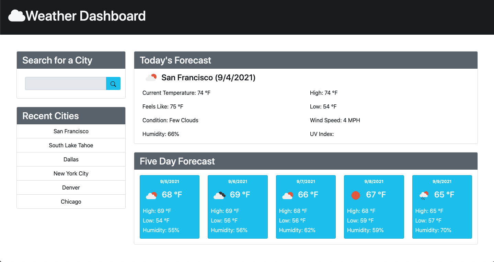

# Weather-Dashboard

## Table of Contents

- [Description](#description)
- [Usage](#usage)
- [Web Page](#web-page)

## Description

The Weather Dashboard is an application that displays a city's current weather data and its five-day forecast which leverages the OpenWeatherMap API.

## Usage

a. Head over to the Weather Dashboard site:
https://azs6189.github.io/Weather-Dashboard/

b. Begin your search by typing the name of the city of your choice in the search box.

c. Then you will be presented with current and future conditions for that city. That city will be added to the search history.

d. You may also click on a city in the search history. You will be presented with current and future conditions for that city again.

## Built With

- HTML5
- JavaScript
- BootStrap 5
- OpenWeatherMap API

## Web Page

https://azs6189.github.io/Weather-Dashboard/

